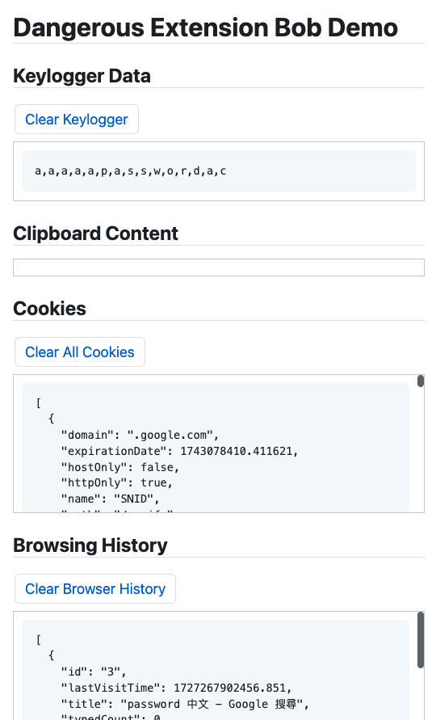

# Dangerous Extension Bob Demo

This is a demo of a browser extension that can log keystrokes, read clipboard content, and more.

You should test this in an isolated environment, such as a new Chrome profile, rather than your main browser.

## Installation

1. Clone the repository
2. Open Chrome (or any Chromium-based browser) and navigate to `chrome://extensions/`
3. Enable "Developer mode" in the top right corner
4. Click "Load unpacked."
5. Select the `browser-extension-spyware-demo` directory
6. Test the extension by clicking on the new icon in the Chrome toolbar
7. You should see a popup with the message "Dangerous Extension Bob is running!"

## Screenshots

